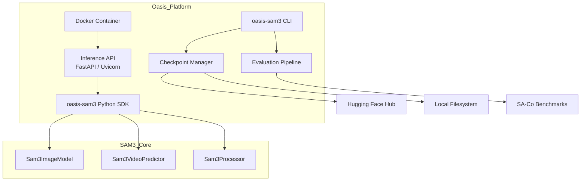

# Design Document: Oasis SAM 3 Adaptation

## Overview

Oasis Company is taking over the SAM 3 project from Meta AI Research. This design covers:

1. Documentation overhaul and rebranding
2. A REST Inference API wrapping the SAM 3 model
3. Checkpoint management utilities
4. Python SDK improvements and PyPI packaging
5. Evaluation and benchmarking pipeline
6. Containerized deployment artifacts
7. SAM 3.2 update roadmap

The core model architecture (encoder, decoder, tracker, multiplex) is preserved as-is. Oasis's work focuses on the surrounding infrastructure, developer experience, and planned model improvements.

---

## Architecture



The Inference API is a thin FastAPI layer that delegates to the existing `sam3` model code via the SDK. The SDK wraps the existing `Sam3Processor` and `build_sam3_*` builder functions with typed interfaces and input validation. The CLI provides commands for checkpoint management and evaluation. Docker packages everything into a deployable container.

---

## Components and Interfaces

### 2.1 Inference API

Built with **FastAPI** and served via **Uvicorn**. Two primary endpoints:

```
POST /segment/image
  Body: multipart/form-data
    - image: file (JPEG/PNG)
    - prompt: string (text) OR prompt_type: "box"/"point" with coordinates
    - batch: optional list of images (up to 8)
  Response 200: { "results": [{ "masks": [...], "boxes": [...], "scores": [...] }] }
  Response 400: { "error": "missing or invalid prompt" }
  Response 415: { "error": "unsupported media type" }
  Response 503: { "error": "model unavailable" }

POST /segment/video
  Body: multipart/form-data
    - video: file (MP4) OR video_path: string
    - prompt: string (text)
    - frame_index: int (default 0)
  Response 200: { "session_id": "...", "outputs": { "frame_index": ..., "masks": [...] } }
  Response 400: { "error": "..." }

GET /health
  Response 200: { "status": "ok", "model": "sam3.1", "checkpoint": "..." }
  Response 503: { "status": "unavailable" }
```

### 2.2 Python SDK (`oasis-sam3`)

Typed wrappers around the existing `sam3` interfaces:

```python
# oasis_sam3/image.py
from dataclasses import dataclass
from typing import List
import numpy as np

@dataclass
class SegmentationResult:
    masks: List[np.ndarray]
    boxes: List[List[float]]   # [x1, y1, x2, y2]
    scores: List[float]

class OasisImageSegmenter:
    def __init__(self, checkpoint: str = "default") -> None: ...
    def segment(self, image: PIL.Image.Image, prompt: str) -> SegmentationResult: ...
    def segment_batch(self, images: List[PIL.Image.Image], prompts: List[str]) -> List[SegmentationResult]: ...

# oasis_sam3/video.py
class OasisVideoSegmenter:
    def __init__(self, checkpoint: str = "default") -> None: ...
    def start_session(self, video_path: str) -> str: ...  # returns session_id
    def add_prompt(self, session_id: str, frame_index: int, prompt: str) -> dict: ...
```

Input validation is enforced at the SDK boundary:
- Empty string prompt → `ValueError("prompt must be a non-empty string")`
- Non-PIL image input → `TypeError("image must be a PIL.Image.Image instance")`
- Batch size > 8 → `ValueError("batch size cannot exceed 8")`

### 2.3 Checkpoint Manager

```python
# oasis_sam3/checkpoint.py
class CheckpointManager:
    def download(self, model_id: str, local_path: str, expected_sha256: str) -> None: ...
    def verify(self, local_path: str, expected_sha256: str) -> bool: ...
    def load(self, local_path: str) -> dict: ...  # returns state dict
```

Retry logic: up to 3 attempts with exponential backoff (1s, 2s, 4s) on download failure.
SHA-256 verification runs before any `torch.load` call.

### 2.4 Evaluation Pipeline

```python
# oasis_sam3/eval/runner.py
class EvalRunner:
    def run_gold(self, subset_size: int | None = None) -> EvalReport: ...
    def run_veval(self, subset_size: int | None = None) -> EvalReport: ...

@dataclass
class EvalReport:
    model: str
    dataset: str
    metrics: dict          # {"cgF1": float, "AP": float, "pHOTA": float}
    baseline_metrics: dict
    warnings: List[str]    # populated if any metric deviates > 2% from baseline
    timestamp: str
```

CLI commands:
```bash
oasis-sam3 eval gold [--subset N] [--output report.json]
oasis-sam3 eval veval [--subset N] [--output report.json]
oasis-sam3 checkpoint download --model sam3.1 --verify
```

---

## Data Models

### SegmentationResult
```python
@dataclass
class SegmentationResult:
    masks: List[np.ndarray]      # HxW binary masks
    boxes: List[List[float]]     # [x1, y1, x2, y2] normalized
    scores: List[float]          # confidence in [0, 1]
```

Invariant: `len(masks) == len(boxes) == len(scores)` always holds.

### EvalReport (JSON schema)
```json
{
  "model": "string",
  "dataset": "string",
  "metrics": { "cgF1": 0.0, "AP": 0.0, "pHOTA": 0.0 },
  "baseline_metrics": { "cgF1": 0.0, "AP": 0.0, "pHOTA": 0.0 },
  "warnings": [],
  "timestamp": "ISO8601"
}
```

### CheckpointManifest
```python
@dataclass
class CheckpointManifest:
    model_id: str
    version: str
    sha256: str
    url: str
    size_bytes: int
```

---

## Correctness Properties

*A property is a characteristic or behavior that should hold true across all valid executions of a system — essentially, a formal statement about what the system should do. Properties serve as the bridge between human-readable specifications and machine-verifiable correctness guarantees.*

### Property 1: Image segmentation result structure invariant

*For any* batch of 1 to 8 valid images with non-empty text prompts, the Inference API `/segment/image` endpoint should return a result for each image where `len(masks) == len(boxes) == len(scores)`.

**Validates: Requirements 2.1, 2.7**

---

### Property 2: Invalid prompt always returns 400

*For any* request to `/segment/image` or `/segment/video` with a missing, empty, or whitespace-only prompt, the Inference API should return HTTP 400.

**Validates: Requirements 2.3**

---

### Property 3: Unsupported media type always returns 415

*For any* request to `/segment/image` with a content type that is not `image/jpeg` or `image/png`, the Inference API should return HTTP 415.

**Validates: Requirements 2.4**

---

### Property 4: Checkpoint hash validation round-trip

*For any* checkpoint file, if the SHA-256 hash of the file matches the expected hash, `CheckpointManager.verify()` should return `True`; if the file is modified in any way, `verify()` should return `False`.

**Validates: Requirements 3.3, 3.5**

---

### Property 5: Checkpoint download retry count

*For any* simulated download that fails on the first N attempts (N ≤ 3) and succeeds on attempt N+1, the `CheckpointManager.download()` method should succeed. If all 3 retries fail, it should raise an error.

**Validates: Requirements 3.2**

---

### Property 6: SDK input validation — non-image input always raises TypeError

*For any* non-PIL-Image value passed to `OasisImageSegmenter.segment()` as the `image` argument, a `TypeError` should be raised.

**Validates: Requirements 4.3**

---

### Property 7: Backward compatibility — sam3 imports remain valid

*For any* public symbol importable from the original `sam3` namespace, that same symbol should remain importable after the Oasis SDK is installed.

**Validates: Requirements 4.5**

---

### Property 8: Evaluation report always contains required fields

*For any* completed evaluation run (gold or veval), the output JSON report should contain the fields `model`, `dataset`, `metrics`, `baseline_metrics`, `warnings`, and `timestamp`, with `metrics` containing `cgF1`, `AP`, and `pHOTA`.

**Validates: Requirements 5.3**

---

### Property 9: Evaluation regression warning fires on >2% deviation

*For any* evaluation result where any metric deviates more than 2% from the baseline, the `EvalReport.warnings` list should be non-empty. If all metrics are within 2%, `warnings` should be empty.

**Validates: Requirements 5.4**

---

### Property 10: Evaluation subset limits sample count

*For any* evaluation run with `subset_size=N`, the number of evaluated samples should be exactly `min(N, total_dataset_size)`.

**Validates: Requirements 5.5**

---

## Error Handling

| Scenario | Component | Behavior |
|---|---|---|
| Empty/missing prompt | SDK + API | `ValueError` in SDK; HTTP 400 from API |
| Non-image input | SDK | `TypeError` |
| Unsupported media type | API | HTTP 415 |
| Checkpoint not found | CheckpointManager | `FileNotFoundError` after 3 retries |
| Checkpoint hash mismatch | CheckpointManager | `ValueError("checkpoint integrity check failed")` |
| Model not loaded | API | HTTP 503 |
| Batch size > 8 | SDK | `ValueError("batch size cannot exceed 8")` |
| Video file not found | SDK | `FileNotFoundError` |

All errors are logged with structured logging (JSON format) including timestamp, error type, and request ID.

---

## Testing Strategy

### Dual Testing Approach

Both unit tests and property-based tests are used. Unit tests cover specific examples and edge cases; property tests verify universal correctness across many generated inputs.

### Property-Based Testing

Library: **Hypothesis** (Python)

Each property test runs a minimum of 100 iterations. Tests are annotated with the property they validate:

```python
# Feature: oasis-sam3-adaptation, Property 1: Image segmentation result structure invariant
@given(batch=st.lists(st.binary(), min_size=1, max_size=8))
def test_result_structure_invariant(batch): ...
```

### Unit Tests

- SDK input validation (empty prompt, non-image input, oversized batch)
- Checkpoint hash verification (matching hash, mismatched hash, corrupted file)
- Evaluation report JSON schema validation
- API endpoint response codes (400, 415, 503, 200)
- Health check endpoint
- Backward compatibility import checks

### SAM 3.2 Roadmap

The following improvements are planned for SAM 3.2:

| Area | Current | Target | Approach |
|---|---|---|---|
| SA-Co/Gold cgF1 | 54.1 | 65.0 | Expanded training data for rare/fine-grained concepts |
| SA-V video cgF1 | 30.3 | 45.0 | Improved temporal consistency in tracker |
| Presence token | baseline | improved | Contrastive training on ambiguous concept pairs |
| Inference speed | baseline | 1.5x | Quantization (INT8) + optimized attention |

Experiment logs will be stored in `.kiro/specs/oasis-sam3-adaptation/experiments/` as structured JSON files with fields: `experiment_id`, `model_config`, `dataset`, `metric_deltas`, `notes`, `date`.
