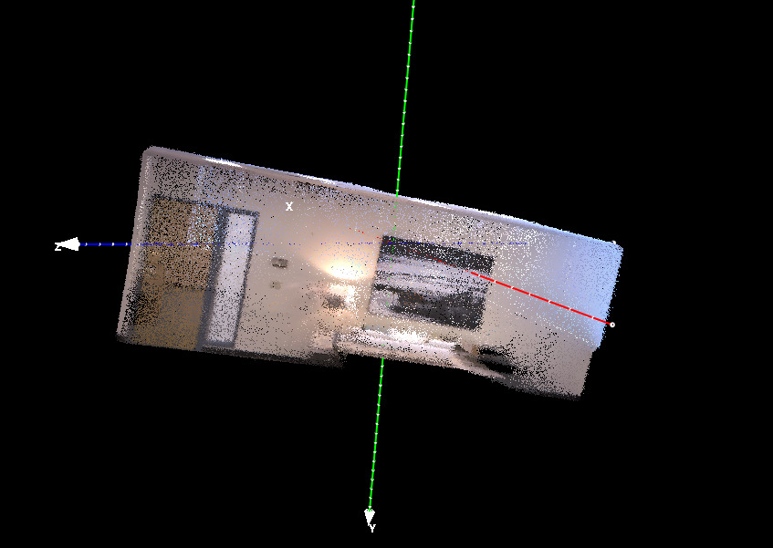
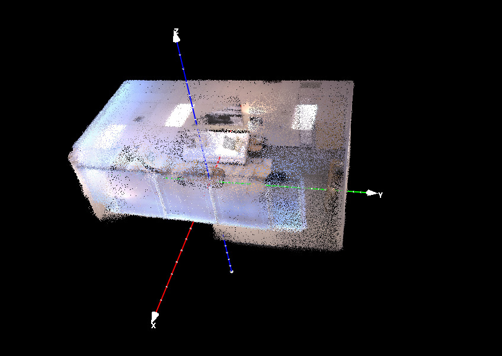
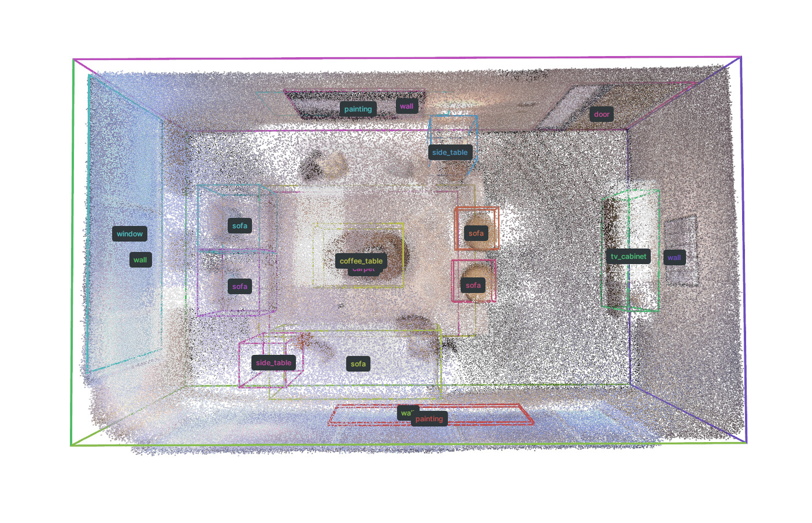
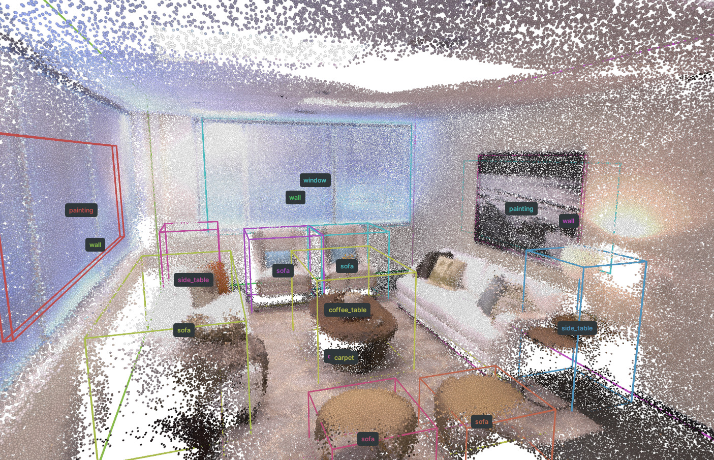

# Example using a custom video

A new open-source SLAM system [SLAM3R](https://github.com/PKU-VCL-3DV/SLAM3R) just released. We found it is great for reconstructing point clouds from RGB inputs as well. Here we provide an example of how to use it to reconstruct a point cloud from a video, and use our model to estimate the layout of the scene. Following steps work for MASt3R-SLAM, and other reconstruction methods as well.

## 1. Reconstruct a point cloud with SLAM3R

Please refer to the [SLAM3R Replica Example](https://github.com/PKU-VCL-3DV/SLAM3R?tab=readme-ov-file#replica-dataset) for the details of how to run SLAM3R on the provided Replica example.

You can set `sample_freq` in this [line](https://github.com/PKU-VCL-3DV/SLAM3R/blob/3831478e15b83509f3f317abc1d4f7bd3cc21e2d/scripts/demo_replica.sh#L8) to 2 to decrease the GPU memory usage and speed up the reconstruction. And you can also try increase the `CONF_THRES_L2W` threshold [here](https://github.com/PKU-VCL-3DV/SLAM3R/blob/3831478e15b83509f3f317abc1d4f7bd3cc21e2d/scripts/demo_replica.sh#L22) to get cleaner point cloud.

If you are using MASt3R-SLAM, we recommend you to increase the `C_conf_threshold` and add some point cloud cleaning steps for each keyframe point cloud exportation in [line](https://github.com/rmurai0610/MASt3R-SLAM/blob/c3d0d5b67bf51d558d7640ff6032407f68041f92/mast3r_slam/evaluate.py#L65), such as removing statistical outliers with following code. These will generally help to get cleaner point clouds.

```python
...
pcd = o3d.geometry.PointCloud()
pcd.points = o3d.utility.Vector3dVector(valid_pts)
pcd.colors = o3d.utility.Vector3dVector(valid_colors)
pcd, trace = pcd.remove_statistical_outlier(nb_neighbors=10, std_ratio=1.5)
points = np.asarray(pcd.points)
color = (np.asarray(pcd.colors) * 255.0).astype(np.uint8)
pointclouds.append(points)
colors.append(color)
```

## 2. Align the output point cloud

In the current version of SpatialLM, input point clouds are considered axis-aligned where the z-axis is the up axis. The input point clouds should follow the ScanNet scenes orientation convension, which is "_Transforms scans to z-up alignment for scans and tries to align walls to x-y planes._" in [Alignment](https://github.com/ScanNet/ScanNet/tree/master/Alignment). Refer to [Issue #7](https://github.com/manycore-research/SpatialLM/issues/7) for more details.

For now, you can choose your way to align the point cloud. We recommend you to check out [VanishingPoint Estimation](https://github.com/yanconglin/VanishingPoint_HoughTransform_GaussianSphere), [Manhattan Frame Estimation from video](https://github.com/jstraub/rtmf), Manhattan Frame Estimation from surface normals (ref paper: Globally Optimal Manhattan Frame Estimation in Real-time, Manhattan World Inference in the Space of Surface Normals) for estimating the Manhattan Frame from image, video or point cloud. And more recent methods such as [U-ARE-ME](https://github.com/callum-rhodes/U-ARE-ME), [Perspective Fields for Single Image Camera Calibration](https://github.com/jinlinyi/PerspectiveFields). Or even use tools like Blender to manually align the point cloud.

|                     Before Alignment                     |                    After Alignment                    |
| :------------------------------------------------------: | :---------------------------------------------------: |
|  |  |

## 3. Ensure the scale of the point cloud

Our model is trained on point clouds with a metric accurate scale. The value 1 refer to 1 meter in the real world. Although we did some scale augmentation during training, but the size may vary from different SLAM systems.

For indoor scenes, you can have a rough estimation of the scale of the scene by the height of the walls. For example, you can resize the aligned point cloud to have a height of 2.5 meters in this example.

```python
import open3d as o3d
from spatiallm.pcd import load_o3d_pcd, get_points_and_colors

point_cloud = load_o3d_pcd(point_cloud_file)
points, colors = get_points_and_colors(point_cloud)
min_z = np.min(points[:, 2])
max_z = np.max(points[:, 2])
height = max_z - min_z
estimated_height = 2.5
scale = estimated_height / height
points = points * scale

# export the point cloud
point_cloud = o3d.geometry.PointCloud()
point_cloud.points = o3d.utility.Vector3dVector(points)
point_cloud.colors = o3d.utility.Vector3dVector(colors.astype(np.float32)/ 255.0)
o3d.io.write_point_cloud(f"scaled_point_cloud.ply", point_cloud)
```

You can also explore more creative approaches to estimate the scale of the point cloud. For example, you can use [Depth Pro](https://github.com/apple/ml-depth-pro) to estimate keyframe depth maps and compare them with keyframe point clouds generated by reconstruction methods like MASt3R-SLAM.

## 4. Run the inference

Now we can run the layout estimation with the aligned and scaled point cloud.

```bash
python inference.py --point_cloud scaled_point_cloud.ply --output replica_layout.txt --model_path manycore-research/SpatialLM-Llama-1B
# visualize the layout
python visualize.py --point_cloud scaled_point_cloud.ply --layout replica_layout.txt --save replica_layout.rrd
rerun replica_layout.rrd
```

|                      View 1                      |                      View 2                      |
| :----------------------------------------------: | :----------------------------------------------: |
|  |  |

## 5. Summary

In this example, we demonstrated how to estimate scene layout from a custom video. The workflow involves four main steps: reconstructing a point cloud from video, aligning it to match the ScanNet orientation convention, scale the point cloud to a roughly metric accurate scale, and finally running our layout estimation model. We will keep improving to make these steps more automated, efficient and robust.

Note that in this example, one sofa is not detected in the prediction. This is because our training data primarily consists of Chinese residential apartments where living rooms typically feature a single main sofa facing a TV, which is on the other side of the room. The model currently has its limitation on generalize very well to more diverse scenarios, such as non-standard layouts, cluttered spaces, or outdoor environments. We are actively working on it, and will try to improve the model's performance to more diverse scenes in the next release.
