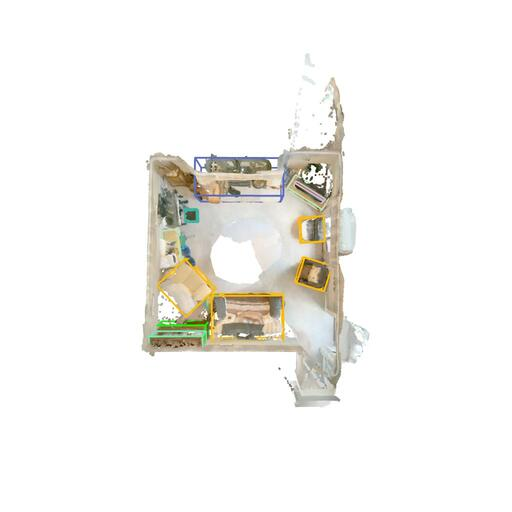
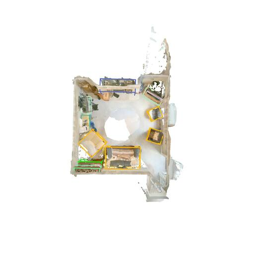
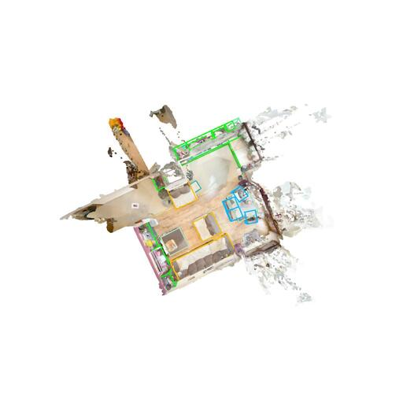
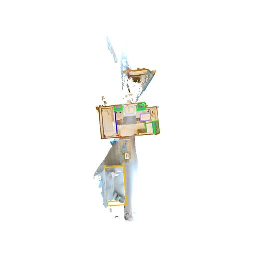

# Finetune SpatialLM

Here we provide a simple example of how to finetune SpatialLM. In this example, we finetune SpatialLM on [ARKitScenes](https://github.com/apple/ARKitScenes) using a new set of object categories and enable random, gravity-aligned scene orientations. During inference, only the z-axis needs to be kept as the up axis; the x and y axes do not need to be aligned.

## Installation

First, follow the installation instructions in [README.md](./README.md#installation). Then, install the training dependencies:

```bash
poe install-training
```

## Dataset

Download the preprocessed [ARKitScenes-SpatialLM](https://huggingface.co/datasets/ysmao/arkitscenes-spatiallm) dataset from Hugging Face. For details about the dataset format and structure, refer to the dataset repository.

```bash
huggingface-cli download ysmao/arkitscenes-spatiallm --repo-type dataset --local-dir arkitscenes-spatiallm
```

After downloading the dataset, extract the files from the compressed chunks:

```bash
cd arkitscenes-spatiallm
chmod +x extract.sh
./extract.sh
```

The GT oriented bounding boxes are stored as TXT files in the `layout` folder, and the point clouds are stored in PLY format in the `pcd` folder. The script `spatiallm/tuner/create_dataset.py` is used to convert the raw data into training data in the ShareGPT format. The downloaded dataset contains the preprocessed training data in ShareGPT format already.

## Training

The training script is adapted from [LLaMA-Factory](https://github.com/hiyouga/LLaMA-Factory), a great open-source project for LLM finetuning. For SpatialLM, we included a minimum subset of features focused on SFT finetuning. Refer to LLaMA-Factory for additional features and broader support.

Refer to [configs/spatiallm_sft.yaml](./configs/spatiallm_sft.yaml) to ensure the configuration settings match your requirements. Key options include:

- `model_name_or_path`: Path to the pretrained SpatialLM model weights
- `template`: Select either `spatiallm_qwen` or `spatiallm_llama` as appropriate
- `dataset_dir`: Path to the downloaded ARKitScenes-SpatialLM dataset
- `save_dir`: Directory to save the preprocessed training dataset
- `output_dir`: Directory for saving model checkpoints
- `learning_rate`: Learning rate for finetuning
- `num_train_epochs`: Number of training epochs for finetuning

### Running Finetuning

To start finetuning, run the following command. Note that full finetuning requires approximately 60GB of CUDA VRAM. More efficient finetuning options, such as LoRA or quantized finetuning are not yet implemented.

```bash
python train.py configs/spatiallm_sft.yaml
```

If you are training on distributed systems, please set the following environment variables as appropriate for your setup:

- `MASTER_ADDR`: The IP address or hostname of the master node (e.g., `127.0.0.1` for single node or the address of the main node in a cluster).
- `MASTER_PORT`: A free port on the master node for communication (e.g., `29500`).
- `NNODES`: Total number of nodes participating in training.
- `NODE_RANK`: Rank of the current node (integer in `[0, NNODES-1]`).
- `NPROC_PER_NODE`: Number of processes (usually GPUs) to launch on each node.

Example for a single-node (multi-GPU) setup:

```bash
export MASTER_ADDR=127.0.0.1
export MASTER_PORT=29500
export NNODES=1
export NODE_RANK=0
export NPROC_PER_NODE=4  # Adjust to the number of GPUs available
```

For multi-node training, set `MASTER_ADDR` to the address of the master node, and adjust `NNODES` and `NODE_RANK` accordingly.

## Testing

Once training is complete, you can use the inference and visualization script to view the prediction results from your finetuned model checkpoints. For more details, please refer to [README.md](./README.md#inference).

For example here we used finetuned model [SpatialLM1.1-Qwen-0.5B-ARKitScenes-SFT](https://huggingface.co/ysmao/SpatialLM1.1-Qwen-0.5B-ARKitScenes-SFT).

```bash
# Inference
python inference.py -d object -p arkitscenes-spatiallm/pcd/42446137.ply -o 42446137.txt --model_path ysmao/SpatialLM1.1-Qwen-0.5B-ARKitScenes-SFT
# Visualization
python visualize.py -p arkitscenes-spatiallm/pcd/42446137.ply -l 42446137.txt --save 42446137.rrd
# Open Rerun Window
rerun 42446137.rrd
```

## Results

Here are some example results comparing ground truth (GT) layouts with predictions (Pred) from the finetuned SpatialLM1.1-Qwen-0.5B model on the ARKitScenes dataset.

<div align="center">

|                    GT                     |                     Pred                      |
| :---------------------------------------: | :-------------------------------------------: |
|  |  |
|  |  |
|  |  |

</div>
